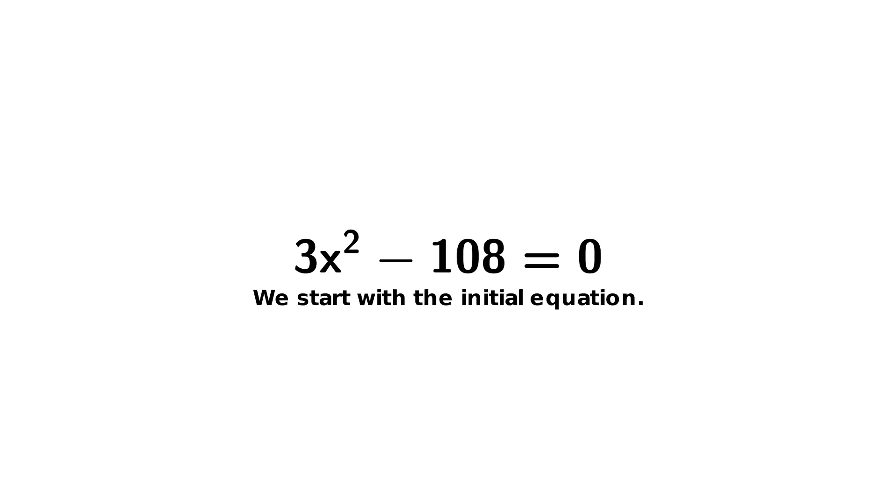

# Quadratic Equation Resolution with Manim

This repository contains a Manim script that visually demonstrates the step-by-step resolution of the quadratic equation:

`3x^2 - 108 = 0`


## Video Preview




## Project Contentsok je veux le 

- `equation_resolution.py`: The Manim script that generates the animation.
- `AcousticGuitar1.mp3`: The background music used in the video.
- `README.md`: This file containing instructions and information about the project.

## Getting Started

Follow these instructions to run the code on your computer and produce the same video.

### Prerequisites

- **Python** 3.7 or higher
- **Manim Community Edition**
- **LaTeX** with necessary packages (`sfmath`, `amsmath`, etc.)
- **FFmpeg** (for audio handling)
- **Optional**: A video editing software (e.g., OpenShot) for additional adjustments.

### Installation

#### 1. Clone the Repository

```bash
git clone https://github.com/Stabadev/manim.git
```

#### 2. Navigate to the Project Directory

```bash
cd manim
```

#### 3. Create a Virtual Environment (Optional but Recommended)

```bash
python -m venv venv
source venv/bin/activate  # On Windows, use: venv\Scripts\activate
```

#### 4. Install Dependencies

```bash
pip install -r requirements.txt
```

Ensure that the `requirements.txt` file contains:

```
manim
```

#### 5. Install LaTeX

- **Ubuntu/Debian**:

  ```bash
  sudo apt-get install texlive-full
  ```

- **macOS**:

  - Install MacTeX from [tug.org/mactex](https://tug.org/mactex/)

- **Windows**:

  - Install MiKTeX from [miktex.org](https://miktex.org/)

Ensure that LaTeX packages `sfmath` and `amsmath` are installed.

#### 6. Verify FFmpeg Installation

Manim uses FFmpeg for audio and video rendering. To verify that FFmpeg is installed:

```bash
ffmpeg -version
```

If FFmpeg is not installed, follow the instructions on [ffmpeg.org](https://ffmpeg.org/download.html).

## Running the Script

Execute the following command to render the video:

```bash
manim -pqh equation_resolution.py EquationResolutionScene
```

- **Options**:

  - `-p`: Preview the video after rendering.
  - `-q h`: Render in high quality. Other options include `l` (low quality), `k` (4K quality), and `p` (production quality).

## Background Music

### Music Information

- **Title**: AcousticGuitar1
- **Artist**: Jason Shaw
- **License**: Creative Commons Attribution 4.0 International License
- **Source**: [Audionautix.com](https://audionautix.com/)

### License Details

All music produced by Jason Shaw on AudionautiX is released under the **Creative Commons Attribution 4.0 International License**.

In simple terms, this means:

- **You are free to**:

  - **Share** — copy and redistribute the material in any medium or format.
  - **Adapt** — remix, transform, and build upon the material for any purpose, even commercially.

- **Under the following terms**:

  - **Attribution**:

    - You must give appropriate credit, provide a link to the license, and indicate if changes were made.
    - You may do so in any reasonable manner, but not in any way that suggests the licensor endorses you or your use.
    - You are free to use the music (even for commercial purposes) as long as you provide a link to this website or credit with: "Music by Audionautix.com".

**Read the full license here**: [Creative Commons Attribution 4.0 International License](https://creativecommons.org/licenses/by/4.0/)

### How to Provide Attribution

In any usage of the music, please include the following attribution:

```
Music by Audionautix.com
```

or

```
Creative Commons Music by Jason Shaw on Audionautix.com
```

## Customization

Feel free to modify the script to suit your preferences. You can adjust:

- Text content and language.
- Font sizes and styles.
- Colors and themes.
- Animation timing and transitions.
- Steps of the equation resolution.

## Font and Readability Enhancements

The script uses a bold, sans-serif font (**DejaVu Sans**) to improve readability on small smartphone screens.

### Custom Font Usage

- **Font**: DejaVu Sans (sans-serif)
- **Weight**: Bold

These settings ensure that the text and equations are clear and easy to read, even on smaller devices.

### Note on Mathematical Fonts

To render equations in sans-serif font, the script uses a custom `TexTemplate` with the LaTeX package `sfmath`. Ensure that this package is installed with your LaTeX distribution.

## Troubleshooting

### Issues with LaTeX or Fonts

- Ensure that LaTeX is correctly installed and that the necessary packages are available.
- If you encounter errors related to fonts, verify that the `DejaVu Sans` font is installed on your system.

### Issues with Audio

- Verify that FFmpeg is installed and accessible from your terminal.
- Ensure that the file `AcousticGuitar1.mp3` is in the same directory as the Python script.

### Issues with Video Rendering

- Update Manim to the latest version:

  ```bash
  pip install --upgrade manim
  ```

- Consult the [Manim Documentation](https://docs.manim.community/) for detailed instructions.

## Additional Video Editing

For further adjustments such as cutting the video or adding audio fade-outs, you can use a video editing software like **OpenShot** (free and open-source).

### Steps for Editing with OpenShot

1. **Install OpenShot**

   ```bash
   sudo apt-get install openshot
   ```

2. **Import the Video into OpenShot**

   - Open OpenShot and import the video rendered by Manim.

3. **Make Adjustments**

   - Cut the video as needed.
   - Adjust the volume or add audio fade-outs if necessary.

4. **Export the Final Video**

   - Choose the desired export format (e.g., MP4 in 1080p).

## License

This project is licensed under the MIT License. See the [LICENSE](LICENSE) file for details.

## Acknowledgments

- **Manim Community**: The animation engine used to create this video.
- **Jason Shaw**: For the background music provided under Creative Commons License.
- [alexandre.rogues.fr](https://alexandre.rogues.fr/cv) : Creator of the script and video.

---

If you have any questions or suggestions, feel free to open an issue or contact me.
